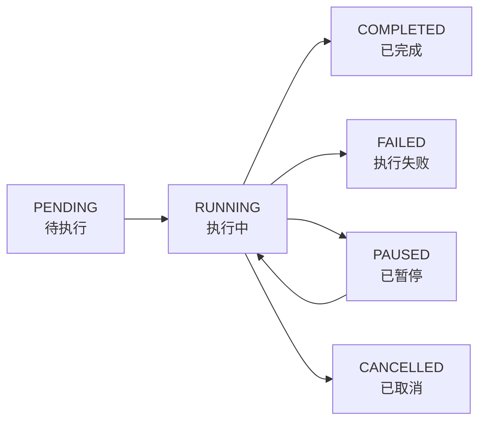

# Elasticsearch数据迁移工具

## 项目简介

elasticsearch-data-flow是一个基于Spring Boot开发的Elasticsearch数据迁移和同步工具，支持索引间的高效数据迁移、字段映射、数据转换等功能。

## 核心功能

- **数据迁移**: 支持Elasticsearch索引间的批量数据迁移
- **索引同步**: 实时或定时同步索引数据
- **字段映射**: 支持源索引和目标索引间的字段映射转换
- **数据转换**: 支持新增字段、大小写转换等数据处理
- **批处理**: 可配置批次大小，优化迁移性能
- **多线程**: 支持多线程并发处理，提高迁移效率
- **Web界面**: 提供Swagger API文档界面，便于操作和监控
- **🎯 实时监控面板**: 提供可视化的任务监控界面，实时查看迁移进度
- **📊 任务管理**: 支持任务创建、暂停、恢复、取消等完整生命周期管理
- **⚡ WebSocket通信**: 实时推送任务状态和进度信息
- **🔍 健康检查**: 全面的系统健康监控，ES连接状态检查和功能测试

## 技术栈

- **Java 8**
- **Spring Boot 2.4.2**
- **Elasticsearch 7.10.2**
- **Spring WebSocket**: 实时通信
- **Swagger/Knife4j**: API文档
- **Bootstrap 5**: 前端UI框架
- **SockJS + STOMP**: WebSocket客户端
- **Lombok**: 简化代码
- **Hutool**: 工具类库

## 快速开始

### 环境要求

- JDK 8+
- Maven 3.6+
- Elasticsearch 7.x

### 配置文件

修改 `src/main/resources/application.yml` 配置文件：

```yaml
# Elasticsearch配置
elasticsearch:
  # 源ES配置
  source:
    host: localhost
    port: 9200
    scheme: http
    username: elastic
    password: your_password
  # 目标ES配置
  target:
    host: localhost
    port: 9200
    scheme: http
    username: elastic
    password: your_password

# ES迁移任务配置
es:
  migration:
    task:
      # 是否启用定时任务
      enabled: false
      # 源索引名称
      source-index: source_index
      # 目标索引名称
      target-index: target_index
      # 批次大小
      batch-size: 1000
```

### 运行项目

1. **克隆项目**
   ```bash
   git clone [项目地址]
   cd elasticsearch-data-flow
   ```

2. **编译项目**
   ```bash
   mvn clean compile
   ```

3. **运行项目**
   ```bash
   mvn spring-boot:run
   ```

4. **访问监控面板**
   项目启动后会自动打开浏览器访问：http://localhost:6618
   
   - **实时监控面板**: http://localhost:6618/monitor.html
   - **API文档**: http://localhost:6618/doc.html
   - **健康检查**: http://localhost:6618/api/health/check
   - **本地资源测试**: http://localhost:6618/test-local-resources.html

## 🎯 实时监控面板

### 主要功能

- **📊 任务监控**: 实时显示所有迁移任务的状态和进度
- **🎮 任务控制**: 一键创建、暂停、恢复、取消任务
- **📈 系统统计**: 实时显示系统运行状态和统计数据
- **⚡ 实时通信**: 基于WebSocket的实时数据推送
- **📱 响应式设计**: 支持桌面和移动设备访问

### 监控面板使用

#### 访问监控面板
```
http://localhost:6618/monitor.html
```

#### 主要界面元素

1. **系统统计卡片**
   - 总任务数、运行中任务数
   - 已完成、失败、等待中任务数
   - 总处理文档数

2. **任务列表**
   - 任务卡片显示任务基本信息
   - 实时进度条和状态指示器
   - 任务操作按钮（详情、暂停、恢复、取消）

3. **实时日志**
   - 系统事件和错误信息
   - 任务状态变化通知
   - 可清空和滚动查看

4. **任务创建**
   - 支持全量迁移、增量迁移、索引同步
   - 可视化配置表单
   - 参数验证和提示

#### 任务生命周期管理



## API接口

### 实时监控接口

- **GET** `/api/monitor/tasks` - 获取所有任务列表
- **GET** `/api/monitor/tasks/{taskId}` - 获取任务详情
- **GET** `/api/monitor/stats` - 获取系统统计信息
- **POST** `/api/monitor/tasks/migration/full` - 创建全量迁移任务
- **POST** `/api/monitor/tasks/migration/incremental` - 创建增量迁移任务
- **POST** `/api/monitor/tasks/sync` - 创建索引同步任务

### 任务控制接口

- **POST** `/api/monitor/tasks/{taskId}/pause` - 暂停任务
- **POST** `/api/monitor/tasks/{taskId}/resume` - 恢复任务
- **POST** `/api/monitor/tasks/{taskId}/cancel` - 取消任务
- **DELETE** `/api/monitor/tasks/{taskId}` - 删除任务

### 数据迁移接口

- **POST** `/api/migration/start` - 启动数据迁移
- **GET** `/api/migration/status` - 查询迁移状态
- **POST** `/api/migration/stop` - 停止迁移任务

### 索引同步接口

- **POST** `/api/sync/start` - 启动索引同步
- **GET** `/api/sync/status` - 查询同步状态
- **POST** `/api/sync/stop` - 停止同步任务

### 配置管理接口

- **GET** `/api/config/migration` - 获取迁移配置
- **POST** `/api/config/migration` - 更新迁移配置

### 系统健康检查接口

- **GET** `/api/health/check` - 综合健康检查
- **GET** `/api/health/es-connections` - ES连接状态检查
- **GET** `/api/health/services` - 服务状态检查
- **GET** `/api/health/quick-test` - 快速功能测试
- **GET** `/api/health/info` - 应用和系统信息
- **GET** `/api/health/exceptions` - 异常统计信息

### 系统统计接口

- **GET** `/api/monitor/stats` - 基础系统统计信息
- **GET** `/api/monitor/stats/enhanced` - 增强版系统统计
- **GET** `/api/monitor/stats/comprehensive` - 完整系统统计报告
- **GET** `/api/monitor/stats/resources` - 系统资源统计
- **GET** `/api/monitor/stats/performance` - 性能统计信息
- **GET** `/api/monitor/stats/trends` - 历史趋势数据
- **POST** `/api/monitor/stats/snapshot` - 手动触发统计快照
- **POST** `/api/monitor/broadcast/enhanced-stats` - 推送增强统计到WebSocket
- **POST** `/api/monitor/alerts/performance` - 发送性能告警

### WebSocket接口

- **连接地址**: `/ws/monitor`
- **订阅频道**:
  - `/topic/tasks` - 任务状态和列表更新
  - `/topic/system` - 系统统计信息
  - `/topic/system-resources` - 系统资源更新
  - `/topic/comprehensive-stats` - 完整统计报告
  - `/topic/alerts` - 性能告警信息
  - `/topic/health` - 系统健康状态
  - `/topic/batch` - 批量更新消息
  - `/topic/errors` - 错误信息推送
  - `/topic/warnings` - 警告信息推送

## 使用示例

### 监控面板使用流程

#### 1. 启动应用并访问监控面板
```bash
# 启动应用
mvn spring-boot:run

# 访问监控面板
# 浏览器打开: http://localhost:6618
```

#### 2. 创建迁移任务
1. 点击"创建任务"按钮
2. 选择任务类型（全量迁移/增量迁移/索引同步）
3. 配置相关参数：
   - **全量迁移**: 源索引、目标索引、批次大小、线程数
   - **增量迁移**: 同全量迁移，会自动获取上次同步时间
   - **索引同步**: 索引名称列表、同步选项（数据/映射/设置）

#### 3. 监控任务执行
- 实时查看任务进度条
- 查看处理速度和预计剩余时间
- 监控成功/失败文档数量
- 查看任务执行日志

#### 4. 任务控制操作
- **暂停**: 暂时停止任务执行
- **恢复**: 继续已暂停的任务
- **取消**: 终止任务执行
- **删除**: 移除已完成的任务记录

### API调用示例

#### 创建全量迁移任务
```bash
curl -X POST http://localhost:6618/api/monitor/tasks/migration/full \
  -H "Content-Type: application/json" \
  -d '{
    "sourceIndex": "my_source_index",
    "targetIndex": "my_target_index",
    "batchSize": 1000,
    "threadCount": 2,
    "scrollTimeout": 5,
    "overwriteExisting": true
  }'
```

#### 查询任务状态
```bash
curl -X GET http://localhost:6618/api/monitor/tasks/{taskId}
```

#### 控制任务执行
```bash
# 暂停任务
curl -X POST http://localhost:6618/api/monitor/tasks/{taskId}/pause

# 恢复任务
curl -X POST http://localhost:6618/api/monitor/tasks/{taskId}/resume

# 取消任务
curl -X POST http://localhost:6618/api/monitor/tasks/{taskId}/cancel
```

### WebSocket客户端示例

```javascript
// 连接WebSocket
const socket = new SockJS('/ws/monitor');
const stompClient = Stomp.over(socket);

stompClient.connect({}, function(frame) {
    console.log('Connected: ' + frame);
    
    // 订阅任务更新
    stompClient.subscribe('/topic/tasks', function(message) {
        const taskUpdate = JSON.parse(message.body);
        console.log('Task update:', taskUpdate);
    });
    
    // 订阅系统统计
    stompClient.subscribe('/topic/system', function(message) {
        const stats = JSON.parse(message.body);
        console.log('System stats:', stats);
    });
});
```

### 系统统计功能示例

#### 1. 获取增强版系统统计
```bash
curl -X GET http://localhost:6618/api/monitor/stats/enhanced
```

**响应示例**：
```json
{
  "success": true,
  "taskStats": {
    "totalTasks": 25,
    "runningTasks": 3,
    "completedTasks": 18,
    "failedTasks": 2,
    "pendingTasks": 2,
    "totalDocuments": 1500000,
    "processedDocuments": 1200000,
    "successDocuments": 1180000,
    "failedDocuments": 20000,
    "successRate": "98.33%",
    "completionRate": "80.00%",
    "averageTaskDuration": "15.30分钟"
  },
  "performanceStats": {
    "currentTotalSpeed": "2500 文档/秒",
    "currentAverageSpeed": "833 文档/秒",
    "overallThroughput": "1250.00 文档/秒",
    "estimatedCompletionTime": "8.5 分钟",
    "totalProcessingTimeHours": "45.50",
    "totalProcessedDocuments": 1180000
  },
  "realtimeMetrics": {
    "systemLoadAverage": "2.45",
    "serverTime": "2024-01-15T10:30:45",
    "uptime": 7245,
    "activeTasks": {
      "task-001": {
        "progress": 75.5,
        "speed": 850,
        "phase": "数据迁移中",
        "duration": 1800
      }
    }
  },
  "timestamp": 1705298445000
}
```

#### 2. 获取系统资源统计
```bash
curl -X GET http://localhost:6618/api/monitor/stats/resources
```

**响应示例**：
```json
{
  "success": true,
  "resourceStats": {
    "memory": {
      "heapUsed": 512,
      "heapMax": 2048,
      "heapCommitted": 1024,
      "heapUsagePercent": "25.00%",
      "nonHeapUsed": 128,
      "nonHeapMax": "无限制"
    },
    "garbageCollection": {
      "totalGcTime": "5430ms",
      "totalGcCount": 145,
      "G1 Young Generation": {
        "collectionCount": 120,
        "collectionTime": "3200ms"
      },
      "G1 Old Generation": {
        "collectionCount": 25,
        "collectionTime": "2230ms"
      }
    },
    "threads": {
      "currentThreadCount": 45,
      "peakThreadCount": 58,
      "totalStartedThreadCount": 235
    },
    "runtime": {
      "availableProcessors": 8,
      "totalMemoryMB": 1024,
      "freeMemoryMB": 512,
      "maxMemoryMB": 2048
    }
  },
  "timestamp": 1705298445000
}
```

#### 3. 获取历史趋势数据
```bash
curl -X GET http://localhost:6618/api/monitor/stats/trends
```

**响应示例**：
```json
{
  "success": true,
  "trendData": {
    "hourlyTrends": [
      {
        "hour": 0,
        "taskCount": 2.5,
        "throughput": 1200.0,
        "errorRate": 0.02
      },
      {
        "hour": 1,
        "taskCount": 3.2,
        "throughput": 1450.0,
        "errorRate": 0.01
      }
    ],
    "dataPoints": 1440
  },
  "timestamp": 1705298445000
}
```

#### 4. 发送性能告警
```bash
curl -X POST "http://localhost:6618/api/monitor/alerts/performance?alertType=HIGH_ERROR_RATE&message=错误率超过阈值" \
  -H "Content-Type: application/json" \
  -d '{
    "errorRate": 15.5,
    "threshold": 10.0,
    "affectedTasks": ["task-001", "task-002"]
  }'
```

#### 5. 完整统计报告
```bash
curl -X GET http://localhost:6618/api/monitor/stats/comprehensive
```

**响应示例**：
```json
{
  "success": true,
  "stats": {
    "taskStats": { /* 任务统计数据 */ },
    "systemResources": { /* 系统资源数据 */ },
    "performanceStats": { /* 性能统计数据 */ },
    "exceptionStats": {
      "totalExceptions": 15,
      "businessExceptions": 8,
      "systemExceptions": 3,
      "networkExceptions": 2,
      "validationExceptions": 2,
      "recentExceptions": 3
    },
    "trendData": { /* 历史趋势数据 */ },
    "realtimeMetrics": { /* 实时指标数据 */ },
    "generatedAt": "2024-01-15T10:30:45",
    "timestamp": 1705298445000
  }
}
```

### 系统健康检查示例

#### 1. 综合健康检查
```bash
curl -X GET http://localhost:6618/api/health/check
```

**响应示例**：
```json
{
  "application": "UP",
  "timestamp": 1678901234567,
  "elasticsearch": {
    "sourceES": "UP",
    "targetES": "UP"
  },
  "services": {
    "migrationService": "UP",
    "indexSyncService": "UP"
  },
  "config": {
    "bufferLimitMB": 10,
    "bufferInitialKB": 10
  },
  "status": "UP"
}
```

#### 2. ES连接状态检查
```bash
curl -X GET http://localhost:6618/api/health/es-connections
```

**响应示例**：
```json
{
  "sourceES": {
    "connected": true,
    "status": "CONNECTED",
    "type": "source"
  },
  "targetES": {
    "connected": true,
    "status": "CONNECTED",
    "type": "target"
  }
}
```

#### 3. 快速功能测试
```bash
curl -X GET http://localhost:6618/api/health/quick-test
```

**响应示例**：
```json
{
  "tests": {
    "getSourceIndices": {
      "success": true,
      "count": 5,
      "sample": ["index1", "index2", "index3"]
    },
    "getTargetIndices": {
      "success": true,
      "count": 3,
      "sample": ["target1", "target2"]
    },
    "configManagement": {
      "success": true,
      "bufferConfig": {
        "bufferLimitMB": 10,
        "bufferInitialKB": 10
      }
    }
  },
  "summary": {
    "totalTests": 3,
    "passedTests": 3,
    "passRate": "100.0%"
  }
}
```

#### 4. 应用和系统信息
```bash
curl -X GET http://localhost:6618/api/health/info
```

**响应示例**：
```json
{
  "appName": "elasticsearch-data-flow",
  "version": "1.0-SNAPSHOT",
  "description": "Elasticsearch数据迁移和同步工具",
  "author": "everflowx",
  "jvm": {
    "totalMemoryMB": 1024,
    "freeMemoryMB": 512,
    "maxMemoryMB": 2048,
    "usedMemoryMB": 512,
    "processors": 8
  },
  "system": {
    "osName": "Linux",
    "osVersion": "5.4.0",
    "javaVersion": "1.8.0_291"
  }
}
```

#### 5. 异常统计信息
```bash
curl -X GET http://localhost:6618/api/health/exceptions
```

**响应示例**：
```json
{
  "success": true,
  "exceptionStats": {
    "totalExceptions": 15,
    "businessExceptions": 8,
    "systemExceptions": 3,
    "networkExceptions": 2,
    "validationExceptions": 2
  },
  "exceptionRates": {
    "businessRate": "53.3%",
    "systemRate": "20.0%",
    "networkRate": "13.3%",
    "validationRate": "13.3%"
  },
  "timestamp": 1678901234567
}
```

### 数据迁移配置示例

```json
{
  "sourceIndex": "source_index",
  "targetIndex": "target_index",
  "batchSize": 1000,
  "scrollTimeout": 10,
  "threadCount": 3,
  "overwriteExisting": true,
  "newFields": {
    "migration_time": "now",
    "migration_version": "1.0"
  },
  "caseInsensitiveFields": ["title", "content"],
  "timestampField": "createTime"
}
```

### 字段映射配置

```json
{
  "fieldMapping": {
    "old_field_name": "new_field_name",
    "create_time": "createTime",
    "update_time": "updateTime"
  }
}
```

### 索引同步配置

```json
{
  "indexNames": ["index1", "index2", "index3"],
  "syncData": true,
  "syncMappings": true,
  "syncSettings": true,
  "syncAliases": true,
  "batchSize": 1000,
  "threadCount": 2,
  "overwriteExisting": false,
  "validateData": true
}
```

## 项目结构

```
src/main/java/com/everflowx/esmigration/
├── Application.java              # 启动类
├── config/                       # 配置类
│   ├── ElasticsearchConfig.java  # ES配置
│   ├── SwaggerConfig.java        # Swagger配置
│   └── WebSocketConfig.java      # WebSocket配置
├── controller/                   # 控制器
│   ├── EsConfigController.java   # 配置管理
│   ├── EsMigrationController.java # 数据迁移
│   ├── IndexSyncController.java  # 索引同步
│   ├── MonitorController.java    # 监控面板API
│   ├── HealthController.java     # 健康检查
│   └── HomeController.java       # 主页重定向
├── domain/                       # 实体类
│   ├── IndexSyncConfig.java      # 同步配置
│   ├── IndexSyncResult.java      # 同步结果
│   ├── MigrationConfig.java      # 迁移配置
│   ├── MigrationTask.java        # 迁移任务实体
│   └── TaskStatus.java           # 任务状态枚举
├── manager/                      # 管理器
│   └── MigrationTaskManager.java # 任务管理器
├── websocket/                    # WebSocket
│   └── MonitorWebSocketHandler.java # 监控WebSocket处理器
├── task/                         # 定时任务
│   ├── EsMigrationTask.java      # 迁移定时任务
│   ├── MonitorPushTask.java      # 监控推送任务
│   └── SystemStatisticsTask.java # 系统统计定时任务
├── service/                      # 服务层
│   ├── EsMigrationService.java   # 迁移服务接口
│   ├── IndexSyncService.java     # 同步服务接口
│   ├── EnhancedMigrationService.java # 增强迁移服务
│   ├── SystemStatisticsService.java # 系统统计服务
│   └── impl/                     # 服务实现
│       ├── EsMigrationServiceImpl.java
│       └── IndexSyncServiceImpl.java
├── exception/                    # 异常处理
│   ├── EsMigrationException.java # 基础异常
│   ├── IndexNotExistsException.java
│   ├── MigrationConfigException.java
│   ├── EsConnectionException.java
│   ├── DataMigrationException.java
│   └── GlobalExceptionHandler.java # 全局异常处理
└── util/                         # 工具类
    ├── EsQueryHelper.java        # ES查询工具
    └── ConfigValidator.java      # 配置验证工具

src/main/resources/
├── static/                       # 静态资源
│   ├── monitor.html              # 监控面板页面
│   └── monitor.js                # 前端JavaScript
├── application.yml               # 应用配置
├── banner.txt                    # 启动横幅
└── logback-spring.xml            # 日志配置
```

## 📊 系统统计功能

### 统计数据收集

系统提供多层次的统计数据收集和分析功能：

#### 📈 任务统计维度
- **任务状态分布**: 按状态统计任务数量（运行中、已完成、失败等）
- **文档处理统计**: 总文档数、已处理数、成功数、失败数
- **任务性能指标**: 成功率、完成率、平均任务时长
- **处理速度统计**: 当前速度、平均速度、整体吞吐量

#### 🖥️ 系统资源监控
- **JVM内存监控**: 堆内存使用情况、非堆内存、内存使用率
- **垃圾回收统计**: GC次数、GC耗时、分代GC详情
- **线程监控**: 当前线程数、峰值线程数、总启动线程数
- **系统运行时**: CPU核心数、系统内存、JVM配置信息

#### ⚡ 实时性能指标
- **系统负载**: 系统平均负载指标
- **活跃任务监控**: 实时任务执行状态和进度
- **服务运行时长**: 系统启动时间和运行时长
- **连接状态**: ES集群连接状态和延迟

#### 📉 历史趋势分析
- **24小时趋势**: 按小时聚合的历史数据
- **性能趋势**: 吞吐量变化、任务数量变化
- **错误率趋势**: 系统错误率的时间序列分析
- **资源使用趋势**: 内存、CPU等资源使用的历史记录

### 统计数据推送机制

#### 🔄 多频率推送策略
- **高频推送**: 每5秒推送基础任务和性能统计
- **中频推送**: 每30秒推送系统资源统计
- **低频推送**: 每10分钟推送完整统计报告
- **快照记录**: 每60秒记录统计快照用于趋势分析

#### 📡 WebSocket实时通信
- **多频道订阅**: 支持不同类型统计数据的独立订阅
- **智能推送**: 根据数据变化幅度决定推送频率
- **批量更新**: 支持批量推送多种统计数据
- **性能告警**: 实时推送系统性能告警信息

#### 🎯 推送频道说明
```javascript
// 订阅不同类型的统计数据
stompClient.subscribe('/topic/system', function(message) {
    // 增强版系统统计 (每5秒)
    const stats = JSON.parse(message.body);
});

stompClient.subscribe('/topic/system-resources', function(message) {
    // 系统资源统计 (每30秒)
    const resources = JSON.parse(message.body);
});

stompClient.subscribe('/topic/comprehensive-stats', function(message) {
    // 完整统计报告 (每10分钟)
    const comprehensive = JSON.parse(message.body);
});

stompClient.subscribe('/topic/alerts', function(message) {
    // 性能告警信息 (实时)
    const alert = JSON.parse(message.body);
});
```

### 前端可视化展示

#### 📊 实时图表组件
- **性能趋势图**: 显示最近20个数据点的处理速度趋势
- **内存使用饼图**: 圆环图显示堆内存使用率
- **CPU使用仪表盘**: 半圆仪表盘显示CPU使用情况
- **历史趋势柱状图**: 24小时吞吐量和任务数趋势

#### 🎨 动态UI组件
- **进度条动画**: 实时更新的进度条和百分比显示
- **状态指示器**: 颜色编码的系统健康状态指示
- **活跃任务列表**: 当前执行任务的详细进度展示
- **告警通知**: 浮动式性能告警通知

#### 📱 响应式图表设计
- **自适应布局**: 图表根据屏幕尺寸自动调整
- **交互式提示**: 鼠标悬停显示详细数据
- **颜色主题**: 基于数据阈值的动态颜色变化
- **加载动画**: 数据加载时的平滑过渡效果

### 统计数据API集成

#### 🔌 RESTful API接口
```bash
# 获取实时统计概览
GET /api/monitor/stats/enhanced

# 获取系统资源详情
GET /api/monitor/stats/resources

# 获取性能统计分析
GET /api/monitor/stats/performance

# 获取历史趋势数据
GET /api/monitor/stats/trends

# 获取完整统计报告
GET /api/monitor/stats/comprehensive
```

#### 📋 统计快照管理
- **自动快照**: 定时记录系统状态快照
- **手动触发**: 支持手动触发统计快照记录
- **数据清理**: 自动清理24小时前的历史数据
- **存储优化**: 内存中缓存优化，防止内存泄漏

### 性能告警机制

#### ⚠️ 告警类型
- **高错误率告警**: 错误率超过设定阈值
- **内存临界告警**: 堆内存使用率超过80%
- **系统过载告警**: 系统负载过高
- **处理缓慢告警**: 处理速度低于预期
- **GC频繁告警**: 垃圾回收时间过长
- **线程池满告警**: 线程池资源耗尽

#### 🚨 告警级别
- **CRITICAL**: 需要立即处理的严重问题
- **WARNING**: 需要关注的警告信息
- **INFO**: 一般性信息提醒

#### 📨 告警推送方式
- **实时WebSocket**: 通过WebSocket立即推送告警
- **前端通知**: 浮动式告警通知栏
- **日志记录**: 详细的告警日志记录
- **API接口**: 支持外部系统集成告警

### 使用建议

#### 🎯 最佳实践
1. **监控频率**: 根据业务需求选择合适的监控频率
2. **告警阈值**: 基于历史数据设置合理的告警阈值
3. **资源优化**: 定期检查系统资源使用情况
4. **趋势分析**: 利用历史趋势数据进行容量规划
5. **异常处理**: 及时响应系统告警和异常信息

#### 📈 性能优化建议
- **内存管理**: 监控堆内存使用，及时调整JVM参数
- **GC调优**: 根据GC统计数据优化垃圾回收策略
- **并发控制**: 基于线程监控调整并发任务数量
- **批次优化**: 根据处理速度统计调整批次大小

## 🎮 监控面板特性

### 实时数据展示
- ✅ **任务进度**: 实时进度条显示，支持百分比和文档数量
- ✅ **处理速度**: 显示当前速度和平均速度指标
- ✅ **预计时间**: 自动计算预计剩余时间
- ✅ **状态监控**: 6种任务状态的可视化显示

### 交互式操作
- ✅ **一键创建**: 可视化表单创建迁移任务
- ✅ **任务控制**: 暂停、恢复、取消、删除操作
- ✅ **详情查看**: 模态框显示完整任务信息
- ✅ **实时日志**: 系统事件和错误信息实时显示

### 响应式设计
- ✅ **多设备支持**: 桌面、平板、手机自适应
- ✅ **现代UI**: Bootstrap 5 + Font Awesome图标
- ✅ **动画效果**: 进度条动画和状态指示器
- ✅ **颜色编码**: 直观的状态颜色系统

### 技术特性
- ✅ **WebSocket通信**: 毫秒级实时数据推送
- ✅ **自动重连**: 网络断开自动重连机制
- ✅ **内存管理**: 自动清理历史任务，防止内存泄漏
- ✅ **并发安全**: 线程安全的任务管理
- ✅ **健康监控**: 实时系统状态检查和故障诊断
- ✅ **智能异常处理**: 分类异常处理、错误追踪和恢复建议
- ✅ **用户友好错误提示**: 详细的错误信息和解决方案指导
- ✅ **多维度统计**: 全方位的系统运行统计和性能分析
- ✅ **实时图表**: 轻量级图表组件，无外部依赖
- ✅ **性能告警**: 智能性能阈值监控和告警推送
- ✅ **历史趋势**: 24小时历史数据趋势分析
- ✅ **资源监控**: JVM和系统资源实时监控

## 注意事项

1. **数据安全**: 迁移前请确保做好数据备份
2. **性能优化**: 根据ES集群性能调整批次大小和线程数
3. **网络稳定**: 确保源ES和目标ES网络连接稳定
4. **权限配置**: 确保ES用户具有相应的读写权限
5. **监控日志**: 关注迁移过程中的错误日志
6. **浏览器兼容**: 推荐使用Chrome、Firefox等现代浏览器访问监控面板
7. **WebSocket支持**: 确保网络环境支持WebSocket连接
8. **离线部署**: 项目已包含所有必需的本地静态资源，支持离线环境部署

## 静态资源说明

项目已将所有外部CDN依赖下载到本地，确保在网络受限环境下正常使用：

### 本地资源文件结构
```
src/main/resources/static/
├── css/
│   ├── bootstrap.min.css      # Bootstrap 5.1.3 样式
│   └── all.min.css           # Font Awesome 6.0.0 样式
├── js/
│   ├── bootstrap.bundle.min.js # Bootstrap 5.1.3 脚本
│   ├── sockjs.min.js         # SockJS 1.5.2 客户端
│   └── stomp.min.js          # STOMP 2.3.3 客户端
├── fonts/
│   ├── fa-brands-400.woff2   # Font Awesome 品牌图标字体
│   ├── fa-regular-400.woff2  # Font Awesome 常规图标字体
│   └── fa-solid-900.woff2    # Font Awesome 实体图标字体
├── monitor.html              # 监控面板主页
├── monitor.js               # 监控面板脚本
└── test-local-resources.html # 本地资源测试页面
```

### 资源加载测试

访问本地资源测试页面验证所有静态资源是否正确加载：
```
http://localhost:6618/test-local-resources.html
```

### 离线部署优势

- ✅ **无外网依赖**: 不需要访问外部CDN
- ✅ **加载速度快**: 本地资源加载更快
- ✅ **稳定可靠**: 避免外部服务不可用的风险
- ✅ **安全合规**: 符合内网环境的安全要求

## 🏥 系统健康检查

### 健康检查功能

系统提供全面的健康检查和监控功能，帮助运维人员快速诊断问题：

#### 🔍 检查项目

1. **应用状态检查**
   - 应用服务运行状态
   - 服务可用性验证
   - 系统时间戳记录

2. **Elasticsearch连接检查**
   - 源ES集群连接状态
   - 目标ES集群连接状态
   - 连接延迟和响应测试

3. **核心服务检查**
   - 迁移服务可用性
   - 索引同步服务状态
   - 服务类加载验证

4. **系统资源监控**
   - JVM内存使用情况
   - 系统处理器信息
   - 操作系统基本信息

5. **功能性测试**
   - 索引列表获取测试
   - 配置管理功能验证
   - 核心API响应测试

6. **异常统计监控**
   - 系统异常分类统计
   - 异常发生频率分析
   - 错误趋势监控
   - 异常追踪ID管理

#### 🎯 使用场景

- **部署验证**: 新环境部署后的完整性检查
- **故障诊断**: 快速定位系统问题根因
- **性能监控**: 定期检查系统资源使用情况
- **运维巡检**: 日常系统状态巡检
- **告警集成**: 可集成到监控告警系统
- **异常分析**: 统计和分析系统异常模式

## 🛡️ 错误处理机制

### 异常分类体系

项目采用分层的异常处理机制，将异常分为以下几个主要类别：

#### 🔧 业务异常 (Business Exceptions)
- **EsMigrationException**: 基础ES迁移异常
- **IndexNotExistsException**: 索引不存在异常
- **MigrationConfigException**: 配置参数异常
- **DataMigrationException**: 数据迁移过程异常
- **DocumentProcessingException**: 文档处理异常

#### 🌐 网络异常 (Network Exceptions)
- **EsConnectionException**: ES连接异常
- **ConnectException**: 网络连接超时
- **SocketTimeoutException**: Socket超时异常
- **IOException**: 输入输出异常

#### ✅ 验证异常 (Validation Exceptions)
- **MethodArgumentNotValidException**: 参数验证失败
- **MissingServletRequestParameterException**: 缺少必需参数
- **HttpMessageNotReadableException**: 请求体格式错误

#### ⚙️ 系统异常 (System Exceptions)
- **RuntimeException**: 运行时异常
- **InterruptedException**: 线程中断异常
- **其他未分类异常**: 兜底处理

### 错误响应格式

所有API接口返回统一的错误响应格式：

```json
{
  "success": false,
  "errorCode": "SPECIFIC_ERROR_CODE",
  "message": "用户友好的错误描述",
  "suggestion": "具体的解决建议",
  "timestamp": 1678901234567,
  "path": "/api/monitor/tasks",
  "traceId": "ERR-12345-67890",
  "exceptionType": "BUSINESS_EXCEPTION"
}
```

### 前端错误处理

#### 错误模态框
- 详细的错误信息展示
- 分类错误代码和追踪ID
- 解决建议和操作指导
- 技术详情折叠显示

#### Toast提示
- 轻量级操作反馈
- 自动消失的成功/警告/错误提示
- 右上角固定位置显示

#### API调用封装
- 统一的错误处理机制
- 自动错误展示和日志记录
- 支持操作上下文信息

### 异常监控和统计

#### 实时统计
- 按类型统计异常数量
- 计算各类异常比率
- 追踪异常发生趋势

#### 健康检查集成
- 通过 `/api/health/exceptions` 查看异常统计
- 集成到系统监控体系
- 支持告警阈值设置

### 重试和熔断机制

#### 智能重试
- 网络异常自动重试（最多3次）
- 指数退避延迟策略
- 可配置重试次数和延迟

#### 断路器模式
- 连续失败阈值检测
- 自动停止后续操作
- 手动重置和恢复机制

### 错误恢复策略

#### 批处理容错
- 单个文档处理失败不影响整体
- 记录失败文档详细信息
- 支持失败重试和跳过

#### 任务级错误处理
- 任务执行异常自动标记失败
- 保留执行进度和错误信息
- 支持从断点继续执行

## 日志配置

项目使用logback进行日志管理，日志文件位于 `log/` 目录：
- `log_info.log`: 信息日志
- `log_warn.log`: 警告日志  
- `log_error.log`: 错误日志

## 开发者

- **作者**: everflowx
- **版本**: 1.0-SNAPSHOT